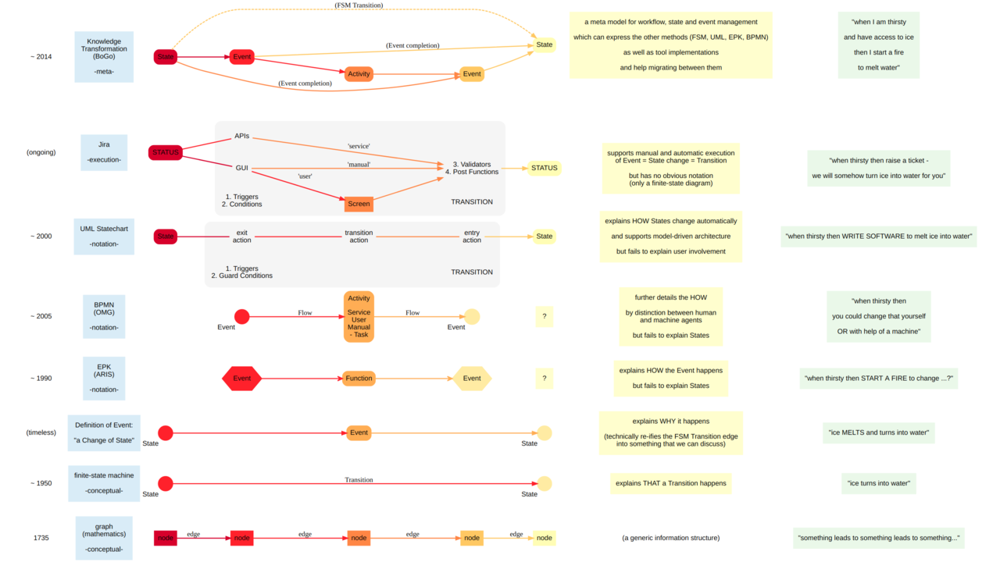

# Workflow Concepts Metamodel Comparison

Did you ever feel uncomfortable when modeling workflows? Because you miss something, or repeat yourself (hello, Aris) in one or another tool or notation?

I did. For more than two decades. And I thought it was my fault: that I did not understand the concept well enough. So I painted my processes as good as I could, given the technical or mental constraints at any time.

Now, after thousands of processes analyzed and a few workflow engines implemented myself: finally I took some time to compare workflow notations formally, on a metamodel level.

Among various formal notations I also added a simple definition of an Event: _"a change of state"_. Because some notations talk about States, others about Events.

For example in the case of H²O, there can be -at least- two states: solid (ice) and liquid (water). We call the Event which changes the state _"melting"_.

And that disctinction made something clear to me: Some notations omit State (EPK, BPMN). Others omit Events or Activities.

Yes you can mimic State by modeling Events for it. But it does not make the model intuitive to understand. Because _"melting"_ and _"liquid water"_ are two different phenomena. 

As a conclusion I added a simple hyper-notation which can express all facets of workflow / state machines. That Knowledge-Transformatoin (KxFm) notation can act as an interchange notation for migrating between notations or tools. Because all models of the other analyzed notations can be expressed in the KxFm notation.

I hope that this overview helps you to understand your favourite notation a littel better.

Please send me comments on this paper so that I can improve it. Thank you for reading!

<object width="100%" data="graph.svg" type="image/svg+xml" ></object>

---
Copyright © 2020 Boran Gögetap [boran@goegetap.name](mailto:boran@goegetap.name), licensed under // lizenziert unter [GNU Affero General Public License](https://www.gnu.org/licenses/agpl-3.0.html)
